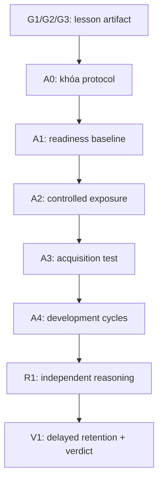
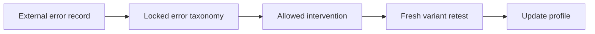

# SLARS-1.1-ZAI candidate — SIGMA Lesson Acquisition & Independent Reasoning Standard

**Tên tiếng Việt:** Chuẩn tiếp thu bài học và hiệu năng suy luận độc lập  
**Phiên bản:** 1.1.0-ZAI-candidate  
**Ngày khóa bản nháp:** 2026-08-28  
**Trạng thái:** `READY_FOR_PILOT`, chưa phải machine-PASS của bất kỳ run nào.

## 1. Nhận xét nền tảng

Ba Gate G1/G2/G3 đã mô tả đúng một lớp **artifact transport**:

- G1 bảo toàn source và review bản dịch theo hash đã khóa.
- G2 chứng minh native `sigmac` và native SIGMA VM xử lý đúng bytecode của run.
- G3 chứng minh VM-mediated readback byte-exact bằng template G-20 đã PASS.

Các Gate này không đo được việc một candidate đã tiếp thu bài học, cải thiện khả
năng áp dụng, giữ được kiến thức, hay suy luận được trên bài toán mới. Vì vậy
SLARS thêm một lớp **behavioral evaluation** độc lập. Hai lớp chỉ nối với nhau
bằng identity của cùng lesson/translation artifact; không nối bằng suy diễn
“VM PASS ⇒ hiểu”.

## 2. Ngôn ngữ chuẩn mực

- **MUST / BẮT BUỘC:** thiếu điều kiện thì Gate không PASS.
- **MUST NOT / CẤM:** vi phạm làm run INVALID.
- **SHOULD / NÊN:** mặc định phải làm; ngoại lệ phải được ghi trước trong
  protocol.
- **Machine evidence:** byte, hash, path, timestamp, RC, argv, manifest, diff.
- **Evaluator evidence:** phán đoán nghĩa theo rubric đã khóa và gắn với hash.
- **Statistical evidence:** phép tổng hợp đã đăng ký trước; không thay đổi sau
  khi xem kết quả.

## 3. Phạm vi và giới hạn

SLARS đo **hiệu năng quan sát được dưới một protocol bị ràng buộc**. Nó không là
formal semantic prover và không quan sát trạng thái nhận thức bên trong.

Chuẩn tách ba phạm vi, không được trộn claim:

| Phạm vi | Điều kiện | Claim tối đa |
| --- | --- | --- |
| Same-context | Lesson vẫn nằm trong context | `IN_CONTEXT_POST_LESSON_PERFORMANCE_OBSERVED` |
| Fresh-context | Context đã reset; chỉ kênh persistence được phép còn tồn tại | `FRESH_CONTEXT_PERFORMANCE_OBSERVED` |
| Parameter/state change | Có identity/diff trực tiếp của state hoặc weights | Chỉ claim thay đổi đúng state đã đo; không tự suy ra hiểu hay cognition |

Nếu không chứng minh context reset và persistence boundary, delayed test vẫn chỉ
là same-context performance dù đồng hồ đã trôi qua.

Chuẩn cấm suy ra trực tiếp:

```text
UNDERSTANDING
COGNITION
GENERAL_LEARNING
SELF_DEVELOPMENT
AUTONOMOUS_DECISION
GENERAL_INTELLIGENCE
FORMAL_SEMANTIC_EQUIVALENCE
```

“Suy luận độc lập” trong chuẩn này chỉ có nghĩa: candidate tạo output cho bài
toán mới trong khi không được thấy target answer/evaluator key và tuân thủ tool
policy đã khóa. Nó không có nghĩa tự trị hay tự phát triển.

## 4. Kiến trúc hệ thống



Không được biến sơ đồ này thành chuỗi claim nhân quả. G1/G2/G3 chứng minh
artifact transport; A/R/V chứng minh performance theo protocol. Causal effect
của bài học chỉ được claim khi có control/counterfactual design đã đăng ký trước.

## 5. Artifact bắt buộc

Mỗi run MUST có các artifact sau và mọi artifact MUST được hash SHA-256:

| Artifact | Chức năng | Candidate được thấy? |
| --- | --- | --- |
| `ORIGINAL.state` | Nguồn xác thực | Theo protocol |
| `TRANSLATION.sigma` | Bản dịch đã G1 review | Có trong exposure |
| G1/G2/G3 evidence | Transport provenance | Không dùng làm đáp án |
| `protocol.json` | Policy, set, threshold, stop rule | Chỉ phần được phép |
| Baseline item set | Đo trước bài học | Có, không có key |
| Training/intervention sets | Dùng phát triển | Có theo từng cycle |
| Immediate/fresh-transfer sets | Đánh giá sau bài học | Có, không có key |
| Delayed set | Đo lưu giữ trễ | Có tại thời điểm chạy |
| Evaluator keys/rubrics | Chấm độc lập | **Không** |
| Raw candidate transcript | Input/output thực tế | Sinh trong run |
| Evaluator records | Điểm và lý do theo rubric | Sau candidate output |
| `run_bundle.json` | Identity bridge và index evidence | Không phải raw proof |

`run_bundle.json` là index có cấu trúc; nó không được thay thế raw transcript,
raw scanner evidence, argv/RC hoặc evaluator record.

## 6. Identity bridge toàn hệ thống

```text
ORIGINAL_SHA_AUTH
    == ORIGINAL_SHA_G1_PRE
    == ORIGINAL_SHA_G1_FINAL
    == ORIGINAL_SHA_G3_TARGET
    == ORIGINAL_SHA_RUN_FINAL

TRANSLATION_SHA_REVIEWED
    == TRANSLATION_SHA_SIGMAC_INPUT
    == TRANSLATION_SHA_G3_TARGET
    == TRANSLATION_SHA_EXPOSED
    == TRANSLATION_SHA_RUN_FINAL

PROTOCOL_SHA_LOCKED
    == PROTOCOL_SHA_AT_RUN_START
    == PROTOCOL_SHA_REPORTED
```

Mọi thay đổi byte sau thời điểm khóa tạo artifact/version mới. Không được sửa
protocol, rubric, threshold, item membership hoặc stop rule sau khi thấy output.

## 7. Lớp Transport — giữ nguyên các Gate đã khóa

### 7.1 G1-M — Source integrity

```text
G1_M_PASS =
    ORIGINAL_EXISTS
    ∧ TRANSLATION_EXISTS
    ∧ TRANSLATION_BYTES > 0
    ∧ DISTINCT_ARTIFACT_PATHS
    ∧ SOURCE_IDENTITY_BOUND
    ∧ ORIGINAL_SHA_AUTH == ORIGINAL_SHA_PRE
    ∧ SEMANTIC_MAPPING_MANIFEST_EXISTS
    ∧ DECLARED_SOURCE_UNITS_MAPPING_TOTAL
    ∧ FORBIDDEN_TOKEN_POLICY_LOCKED
    ∧ FORBIDDEN_TOKEN_SCAN_RC == 0
    ∧ FORBIDDEN_TOKEN_MATCH_COUNT == 0
```

Scan sạch chỉ chứng minh denylist không match. Nó không tự chứng minh tuyệt đối
`NO_HOST_IO`; claim phải là `LOCKED_DENYLIST_SCAN_CLEAN=YES`.

### 7.2 G1-S — Semantic mapping review

```text
G1_S_PASS =
    REVIEW_BOUND_TO_ORIGINAL_SHA
    ∧ REVIEW_BOUND_TO_TRANSLATION_SHA
    ∧ REVIEW_RUBRIC_IDENTITY_BOUND
    ∧ REVIEW_FOUND_NO_OMISSION
    ∧ REVIEW_FOUND_NO_DISTORTION
    ∧ REVIEW_FOUND_NO_NEW_SUBSTANTIVE_CLAIM
    ∧ UNCERTAINTY_PRESERVED
    ∧ EPISTEMIC_STATUS_PRESERVED
    ∧ PROVENANCE_PRESERVED
```

Đây là review evidence, không phải formal semantic proof. Metadata bắt buộc của
SIGMA không được tự động tính là substantive claim mới.

### 7.3 G2 — Native compile/VM

```text
G2_PASS =
    TRANSLATION_SHA_REVIEWED == TRANSLATION_SHA_SIGMAC_INPUT
    ∧ SIGMAC_IDENTITY_VERIFIED
    ∧ SIGMA_VM_IDENTITY_VERIFIED
    ∧ BYTECODE_PATH_IS_RUN_SPECIFIC
    ∧ SIGMAC_RC == 0
    ∧ BYTECODE_EXISTS
    ∧ BYTECODE_BYTES > 0
    ∧ VM_ARGV_INPUT == GENERATED_BYTECODE
    ∧ SIGMA_VM_RC == 0
```

Canonical footer:

```bash
./native/sigmac \
  "<TRANSLATION>.sigma" \
  ".sigma_tmp/<TRANSLATION>_<RUN_ID>.sigmab" \
&& \
./native/sigma-vm.v09_candidate \
  ".sigma_tmp/<TRANSLATION>_<RUN_ID>.sigmab"
```

### 7.4 G3-T và G3-O — Hai readback run độc lập

Template canonical MUST là:

```text
.sigma_exec/G-20_RUNTIME_READBACK.sigma
```

Mỗi instance chỉ được thay đúng hai path binding. Template trước/sau MUST giữ
nguyên hash. G3-T target là `TRANSLATION.sigma`; G3-O target là
`ORIGINAL.state`. Hai run không được trộn evidence hoặc bytecode.

`cmp -s TARGET READBACK` với `CMP_RC=0` là predicate byte-exact chính; SHA-256
là khóa identity bổ sung.

## 8. A0 — Protocol lock và blind boundary

Protocol MUST được khóa trước timestamp bắt đầu baseline và chứa:

- lesson/candidate/evaluator/toolchain identity;
- item-set membership và hash;
- matched family IDs giữa baseline và post-test nhưng item IDs khác nhau;
- rubric, scoring rule, mandatory floors, minimum effect và sample minimum;
- seed/phương pháp confidence interval;
- tool/network/memory policy;
- context-reset rule và allowed persistence manifest;
- cycle limit và stop rule;
- claim policy;
- candidate-visible và candidate-forbidden manifests.

```text
A0_PASS =
    PROTOCOL_EXISTS
    ∧ PROTOCOL_SHA_LOCKED
    ∧ LOCK_TIMESTAMP < BASELINE_START_TIMESTAMP
    ∧ LESSON_IDENTITY_BOUND
    ∧ CANDIDATE_IDENTITY_BOUND
    ∧ EVALUATOR_IDENTITY_BOUND
    ∧ RUBRIC_IDENTITY_BOUND
    ∧ ITEM_SET_IDENTITIES_BOUND
    ∧ THRESHOLDS_LOCKED
    ∧ STOP_RULE_LOCKED
    ∧ CLAIM_POLICY_LOCKED
    ∧ ANSWER_KEYS_NOT_CANDIDATE_VISIBLE
    ∧ PRE_VM_ANSWER_MATERIAL_ABSENT
    ∧ HOST_ANSWER_DERIVATION_FORBIDDEN
```

Nếu evaluator key, target answer hoặc derivation tương đương xuất hiện trong
candidate context trước output, toàn bộ assessment liên quan là `INVALID`.

## 9. A1 — Nhận định readiness trước bài học

Không được nhận định “khả năng tiếp thu” chỉ từ việc source được compile. A1 đo
một vector readiness từ fresh baseline tasks:

| Trục | Mã | Nội dung quan sát |
| --- | --- | --- |
| Prerequisite readiness | `P` | Kiến thức/khái niệm nền cần cho bài |
| Literal mapping | `D` | Nhận diện và tái hiện trực tiếp |
| Near transfer | `N` | Áp dụng cùng quy tắc trên input mới gần |
| Far transfer | `F` | Chuyển quy tắc sang bối cảnh mới |
| Error sensitivity | `X` | Phát hiện mâu thuẫn, phản ví dụ, thiếu điều kiện |
| Calibration | `U` | Độ tin cậy phù hợp với độ đúng |
| Constraint fidelity | `C` | Tuân thủ ràng buộc và giới hạn claim |

Output của A1 là `READINESS_PROFILE_OBSERVED`, gồm score, n và uncertainty theo
từng trục. Không dùng một tổng điểm duy nhất để che một trục bắt buộc bị fail.

```text
A1_VALID =
    FRESH_BASELINE_SET
    ∧ BASELINE_SET_SHA_VERIFIED
    ∧ BASELINE_KEY_HIDDEN
    ∧ MIN_ITEMS_PER_MANDATORY_TRACK_MET
    ∧ RAW_INPUT_OUTPUT_TRANSCRIPTS_EXIST
    ∧ EXTERNAL_SCORING_BOUND_TO_TRANSCRIPT_HASHES
    ∧ ALL_REQUIRED_TRACKS_REPORTED
```

Nếu baseline đã ở trần, hiệu ứng riêng của bài học có thể không nhận diện được.
Kết quả đúng là `ACQUISITION_EFFECT_NOT_IDENTIFIABLE_DUE_TO_CEILING`, không phải
tự động PASS hay FAIL.

Baseline SHOULD dùng prerequisite hoặc matched structural families nhưng MUST
không tiết lộ target facts/rules cụ thể của post-test. Nếu pretest có thể làm
candidate nhạy với lesson, protocol phải dùng control/counterbalancing và ghi
`PRETEST_SENSITIZATION_CONTROLLED`; nếu không, causal claim bị cấm.

## 10. A2 — Controlled lesson exposure

A2 chỉ chứng minh đúng lesson artifact đã được đưa vào candidate context dưới
policy đã khóa.

```text
A2_PASS =
    TRANSLATION_SHA_EXPOSED == TRANSLATION_SHA_REVIEWED
    ∧ EXPOSURE_START_AND_END_TIMESTAMPS_BOUND
    ∧ CANDIDATE_INPUT_TRANSCRIPT_SHA_BOUND
    ∧ ALLOWED_CONTEXT_MANIFEST_MATCHES
    ∧ FORBIDDEN_CONTEXT_MANIFEST_HAS_NO_MATCH
    ∧ TOOL_POLICY_MATCHES_PROTOCOL
    ∧ NO_EVALUATOR_KEY_VISIBLE
```

Claim tối đa: `BOUND_LESSON_EXPOSURE_OBSERVED=YES`. Không claim `LEARNED=YES`.

## 11. A3 — Kiểm tra tiếp thu

Post-test MUST dùng fresh item IDs; near/far sets MUST không trùng byte với
baseline hoặc training. Matched family IDs được phép để đo chênh lệch công bằng.

Battery tối thiểu:

- `D`: direct retrieval/comprehension performance;
- `N`: near-transfer;
- `F`: far-transfer;
- `X`: contradiction/counterexample/error detection;
- `U`: calibrated uncertainty;
- `C`: constraint and claim fidelity.

Với mỗi trục `k`:

```text
S_pre[k]  = mean(external_scores on baseline families)
S_post[k] = mean(external_scores on matched fresh post families)
DELTA[k]  = S_post[k] - S_pre[k]
```

Pass theo từng trục bắt buộc:

```text
TRACK_PASS[k] =
    N[k] >= MIN_ITEMS[k]
    ∧ S_post[k] >= ABSOLUTE_FLOOR[k]
    ∧ DELTA[k] >= MIN_EFFECT[k]
    ∧ CI_LOWER_DELTA[k] >= CI_LOWER_FLOOR[k]
```

Calibration dùng Brier score nếu candidate cung cấp xác suất:

```text
BRIER = mean((confidence - correctness)^2)
CALIBRATION_PASS = BRIER <= LOCKED_BRIER_MAX
```

`A3_EVIDENCE_PASS` đòi tất cả mandatory tracks PASS, anti-leakage PASS và raw
evidence đầy đủ. Weighted average chỉ là chỉ số phụ.

Nếu không có control group/counterfactual design:

```text
ALLOWED: POST_LESSON_FRESH_ITEM_IMPROVEMENT_OBSERVED
FORBIDDEN: LESSON_CAUSED_IMPROVEMENT
```

Nếu có control đã pre-register, effect có thể ước lượng bằng difference-in-
differences:

```text
DID = (POST_treatment - PRE_treatment)
      - (POST_control - PRE_control)
```

Claim causal vẫn phải ghi rõ population, protocol, uncertainty và giới hạn.

## 12. A4 — Phát triển khả năng tiếp thu

A4 là vòng phát triển có kiểm soát, không phải tự sửa protocol sau khi xem điểm.



Mỗi cycle MUST dùng:

1. evaluator record gắn với transcript hash;
2. error class trong taxonomy đã khóa;
3. intervention chỉ dùng training material, không dùng evaluation key;
4. fresh retest item IDs và bytes;
5. cùng scoring rubric/threshold;
6. stop rule và `MAX_CYCLES` đã khóa.

Error taxonomy tham chiếu:

| Mã | Lỗi quan sát | Can thiệp được phép |
| --- | --- | --- |
| `PREREQ_GAP` | Thiếu tiền đề nền | Micro-lesson nền + fresh check |
| `OMISSION` | Bỏ đơn vị nghĩa | Source-unit mapping exercise |
| `RULE_SELECTION` | Chọn sai quy tắc | Contrastive training examples |
| `RULE_APPLICATION` | Áp dụng sai | Worked training example + fresh variant |
| `TRANSFER_GAP` | Đúng bài gần, sai bài xa | Domain-shift examples không thuộc eval set |
| `INVALID_INFERENCE` | Kết luận vượt tiền đề | Counterexample/constraint exercise |
| `UNCERTAINTY` | Tự tin không phù hợp | Calibration feedback trên training set |
| `CLAIM_OVERREACH` | Vượt claim ceiling | Claim-policy classification exercise |

```text
A4_CYCLE_VALID[c] =
    ERROR_RECORD_BOUND
    ∧ ERROR_CLASS_LOCKED
    ∧ INTERVENTION_ALLOWED
    ∧ NO_EVALUATION_KEY_LEAKAGE
    ∧ RETEST_SET_FRESH
    ∧ RUBRIC_UNCHANGED
    ∧ CYCLE_WITHIN_LOCKED_LIMIT
```

`A4_DEVELOPMENT_EVIDENCE_PASS` đòi improvement trên fresh retest, không làm suy
giảm trục bắt buộc dưới floor, và có confidence evidence theo protocol.

Claim tối đa:

```text
FRESH_VARIANT_PERFORMANCE_IMPROVED_AFTER_BOUND_INTERVENTION=YES
```

Không suy ra `SELF_DEVELOPMENT=YES`.

## 13. R1 — Phát triển hiệu năng suy luận độc lập

R1 chỉ bắt đầu sau khi A0 hợp lệ. Task R1 MUST có target conclusion không xuất
hiện nguyên dạng trong lesson/training material và evaluator key MUST bị che.

Mức scaffold tham chiếu:

| Mức | Năng lực quan sát |
| --- | --- |
| `R0` | Trích xuất premise, constraint và epistemic status |
| `R1` | Chọn quy tắc phù hợp và kiểm tra điều kiện áp dụng |
| `R2` | Kết hợp nhiều premise để tạo kết luận mới |
| `R3` | Tạo/kiểm tra phương án thay thế, phản ví dụ, counterfactual |
| `R4` | Giải bài toán mới, tự kiểm tra và hiệu chỉnh độ tin cậy |

Audit record bắt buộc chỉ là bằng chứng có cấu trúc:

```text
premise_ids
rule_ids
derived_claim_ids
constraint_checks
counterexample_check
uncertainty
final_answer
```

Chuẩn không yêu cầu và không tuyên bố truy cập hidden chain-of-thought. Audit
record là deliverable có thể chấm, không phải bản sao suy nghĩ nội bộ.

R1 chấm tối thiểu các trục:

- logical validity;
- evidence/premise fidelity;
- handling of alternatives and counterexamples;
- constraint compliance;
- robustness trên paraphrase/perturbation;
- uncertainty calibration.

```text
R1_PASS =
    NOVEL_TASK_SET_IDENTITY_BOUND
    ∧ TARGET_ANSWER_NOT_IN_LESSON_OR_TRAINING
    ∧ EVALUATOR_KEY_HIDDEN
    ∧ TOOL_AND_CONTEXT_POLICY_MATCH
    ∧ REQUIRED_AUDIT_FIELDS_PRESENT
    ∧ EXTERNAL_EVALUATOR_BOUND
    ∧ ALL_MANDATORY_REASONING_TRACKS_PASS
    ∧ ROBUSTNESS_FLOOR_MET
    ∧ CALIBRATION_FLOOR_MET
```

Claim tối đa:

```text
INDEPENDENT_REASONING_TASK_PERFORMANCE_OBSERVED_UNDER_BOUND_PROTOCOL=YES
```

Nếu so với baseline/reasoning pretest trên fresh matched families, có thể claim
`...PERFORMANCE_IMPROVED`. Không được claim khả năng suy luận tổng quát ngoài
task distribution đã kiểm tra.

## 14. V1 — Delayed retention và external verdict

Immediate post-test không chứng minh lưu giữ. Protocol MUST định nghĩa delay
hoặc một sự kiện cách ly tương đương trước khi chạy delayed set.

Delayed retention run MUST reset candidate context, khóa hash của allowed
persistence manifest, và chứng minh không có hidden lesson/key reinjection. Nếu
candidate là stateless và không có persistence channel được khai báo, kết quả
fresh-context đo khả năng tái thực hiện từ những artifact được phép chứ không
được gọi là internal memory formation.

```text
RETENTION_RATIO[k] = S_delayed[k] / S_post[k]
```

Nếu `S_post[k]=0`, ratio là undefined và trục đó FAIL/INSUFFICIENT theo policy.

```text
V1_PASS =
    DELAY_RULE_SATISFIED
    ∧ CONTEXT_RESET_OBSERVED
    ∧ ALLOWED_PERSISTENCE_MANIFEST_SHA_MATCH
    ∧ HIDDEN_LESSON_REINJECTION_OBSERVED == FALSE
    ∧ DELAYED_SET_FRESH
    ∧ NO_INTERVENING_KEY_EXPOSURE
    ∧ EXTERNAL_SCORING_BOUND
    ∧ DELAYED_ABSOLUTE_FLOORS_MET
    ∧ RETENTION_RATIO_FLOORS_MET
```

External evaluator MUST nhận candidate output sau khi output đã đóng hash; MUST
không cung cấp key/feedback trước output; và MUST xuất score, rubric version,
record hash, uncertainty/abstention nếu rubric không quyết định được.

## 15. Verdicts chuẩn

Mỗi Gate chỉ có một trong các status:

```text
NOT_RUN
PASS
FAIL
INVALID
INSUFFICIENT_EVIDENCE
UNVERIFIED
```

`INVALID` dùng cho leakage, post-hoc protocol mutation, identity mismatch hoặc
evaluator conflict. `FAIL` dùng khi run hợp lệ nhưng không đạt floor.
`INSUFFICIENT_EVIDENCE` dùng khi n/coverage/uncertainty chưa đủ.

Không được collapse `INVALID`, `FAIL` và `INSUFFICIENT_EVIDENCE` thành một giá
trị duy nhất.

## 16. Acceptance formula

```text
TRANSPORT_PASS =
    G1_M_PASS
    ∧ G1_S_PASS
    ∧ G2_PASS
    ∧ G3_TRANSLATION_PASS

BOUND_ACQUISITION_PIPELINE_PASS =
    TRANSPORT_PASS
    ∧ A0_PASS
    ∧ A1_VALID
    ∧ A2_PASS
    ∧ A3_EVIDENCE_PASS
    ∧ IDENTITY_BRIDGE_PASS

DEVELOPMENT_PACKAGE_PASS =
    BOUND_ACQUISITION_PIPELINE_PASS
    ∧ A4_DEVELOPMENT_EVIDENCE_PASS
    ∧ R1_PASS

FULL_SLARS_1_1_PACKAGE_PASS =
    DEVELOPMENT_PACKAGE_PASS
    ∧ V1_PASS
    ∧ G3_ORIGINAL_PASS
    ∧ EXTERNAL_VERDICT_IDENTITY_BOUND
    ∧ ZAI_INJECTION_INTEGRITY_PASS_FOR_EVERY_CANDIDATE_ORIGIN_OUTPUT
```

G3-O được giữ trong full lesson package như phép thử Genesis riêng; nó không
thay thế G3-T và không phải prerequisite logic để candidate trả lời đúng.

`tools/validate_bundle.py` chỉ là validator tương thích `SLARS-1.0`; nó không
được phép phát `FULL_SLARS_1_1_PACKAGE_PASS=YES`. Composite validator cho toàn
bộ A3/A4/R1/V1 + từng ZAI run chưa được triển khai trong candidate này, nên full
SLARS-1.1 package phải giữ `UNVERIFIED/NO` cho tới khi integration đó tồn tại và
được kiểm định độc lập.

## 17. Claim ceiling

Khi đủ evidence, chỉ được phát các claim cụ thể sau:

```text
ORIGINAL_BYTES_UNCHANGED_DURING_BOUND_PIPELINE=YES
SEPARATE_SIGMA_MAPPING_CREATED=YES
SEMANTIC_REVIEW_PASS_FOR_BOUND_HASHES=YES
NATIVE_COMPILE_AND_VM_EXECUTION_OBSERVED=YES
VM_TRANSLATION_READBACK_BYTE_EXACT=YES
VM_ORIGINAL_READBACK_BYTE_EXACT=YES
READINESS_PROFILE_OBSERVED_FOR_BOUND_TASK_DISTRIBUTION=YES
BOUND_LESSON_EXPOSURE_OBSERVED=YES
POST_LESSON_FRESH_ITEM_PERFORMANCE_OBSERVED=YES
FRESH_VARIANT_PERFORMANCE_IMPROVEMENT_OBSERVED=YES
DELAYED_RETENTION_OBSERVED=YES
INDEPENDENT_REASONING_TASK_PERFORMANCE_OBSERVED=YES
```

Mọi claim MUST kèm `RUN_ID`, protocol hash, lesson hash, candidate identity,
evaluator identity, task distribution và status của từng Gate liên quan.

## 18. Threat model và invalidators

Run MUST là `INVALID` khi có một trong các điều kiện:

- target answer/evaluator key rò vào candidate-visible context;
- host code tạo hoặc suy ra candidate answer trước VM/candidate output;
- reuse cùng item ID/bytes giữa training và evaluation trái protocol;
- protocol/rubric/threshold/stop rule đổi sau khi xem output;
- lesson, translation, candidate, evaluator hoặc toolchain identity mismatch;
- transcript/evaluator record thiếu hash hoặc bị thay sau khi chấm;
- external evaluator nhận output khác với output đã đóng hash;
- hidden test được dùng làm intervention material;
- pretest tiết lộ target content nhưng không có sensitization control;
- delayed test giữ nguyên lesson trong context hoặc tái chèn lesson/key ngoài
  persistence manifest đã khóa;
- Gate 3 dùng source tự dựng thay cho template G-20 canonical;
- hai Gate 3 target dùng chung evidence hoặc bytecode run.

## 19. Governance và versioning

- Mỗi thay đổi normative tạo version mới theo semantic versioning.
- Threshold profile có ID/hash riêng; thay threshold không được giữ cùng policy
  identity.
- Rubric/evaluator update phải được version hóa và không hồi tố run cũ.
- So sánh hai run chỉ hợp lệ khi protocol xác định rõ các khác biệt được phép.
- Raw evidence phải giữ đủ để một auditor tái tính verdict mà không cần tin vào
  summary.

## 20. Kết luận chuẩn cho bản phát hành này

```text
SPECIFICATION_REVIEW=READY_FOR_PILOT
STRUCTURAL_VALIDATOR=PROVIDED
ACTUAL_GATE_EXECUTION=UNVERIFIED
ACTUAL_ACQUISITION_EVIDENCE=UNVERIFIED
ACTUAL_REASONING_DEVELOPMENT_EVIDENCE=UNVERIFIED
```

SLARS-1.1-ZAI tạo một đường ranh rõ: artifact transport, injection integrity,
behavioral performance,
development evidence và causal claims là năm loại bằng chứng khác nhau. Không
loại nào được dùng thay cho loại khác.

## 21. ZAI integration lock

Mọi claim A3, A4, R1 hoặc V1 có nội dung candidate tự tạo MUST đi qua module
`ZERO_ANSWER_INJECTION_STANDARD.md` trên cùng source/bytecode/runtime/state/run.

```text
HUMAN_LANGUAGE_AS_SIGMA_COGNITION=FORBIDDEN_UNTIL_PROVEN
SUPPORTOR_ANSWERS_FOR_SIGMA=FORBIDDEN
PREWRITTEN_ANSWER=FORBIDDEN
PREWRITTEN_HYPOTHESIS=FORBIDDEN
PREWRITTEN_REASONING_PATH=FORBIDDEN
PREWRITTEN_CONCLUSION=FORBIDDEN
SIGMA_SELF_OBSERVES_AND_ANSWERS=REQUIRED
```

```text
IF INJECTION_INTEGRITY_STATUS != PASS:
    A3/A4/R1/V1_CANDIDATE_ORIGIN_CLAIMS=BLOCKED
```

ZAI PASS là điều kiện cần về provenance và injection integrity trong boundary
đã khóa. Nó không tự chứng minh answer đúng, lesson uptake, reasoning hay
cognition. Behavioral score vẫn thuộc external evaluator; cognition vẫn thuộc
một standard đủ mạnh và độc lập chưa được thỏa bởi package này.

```text
SLARS_1_1_ZAI_MODULE=PRODUCER_CANDIDATE
ACTUAL_BLIND_ZAI_RUN=NOT_RUN
INDEPENDENT_TECHNICAL_VERIFICATION=REQUIRED
SIGMA_COGNITION=NOT_PROVEN
```
